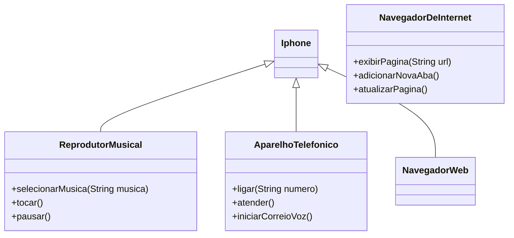

# README.md relativo ao desafio de criar um diagrama de classes usando UML para Bootcamp DIO - Claro - Java com Springboot

```mermaid
classDiagram
    Iphone <|-- ReprodutorMusical
    Iphone <|-- AparelhoTelefonico
    Iphone <|-- NavegadorWeb

 

    class ReprodutorMusical{
      +selecionarMusica(String musica)
      +tocar()
      +pausar()
    }

    class AparelhoTelefonico{
      +ligar(String numero)
      +atender()
      +iniciarCorreioVoz()
    }
    class NavegadorDeInternet{
      +exibirPagina(String url)
      +adicionarNovaAba()
      +atualizarPagina()
    }
```
